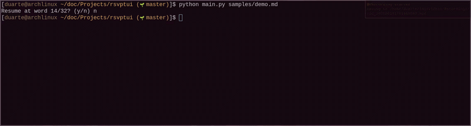

# rsvptui

A terminal-based ebook reader using **Rapid Serial Visual Presentation** (RSVP), which is the technique of displaying words one at a time at a fixed focal point to reduce saccadic eye movements and increase reading speed.

## What is RSVP?

[Rapid Serial Visual Presentation](https://en.wikipedia.org/wiki/Rapid_serial_visual_presentation) is a reading method where text is presented one word at a time in the same screen position. By eliminating the need for eye movement across lines of text, it can significantly increase reading speed and reduce fatigue. This TUI brings that technique to the terminal for plain text files.

## Demo



## Install

Requires Python 3.10+. No external dependencies, only the standard library.

```bash
git clone https://github.com/duartej/rsvptui
cd rsvptui
python main.py <file>
```

## Usage

```bash
python main.py samples/chapter-test.txt
```

On startup, if a previous session was saved for the same file, you'll be prompted to resume.

### Key Bindings

| Key | Action |
|---|---|
| `q` / `Ctrl+C` | Quit |
| `?` | Help panel |
| `m` | Toggle Auto / Manual mode |
| `Space` / `p` | Pause / resume (auto mode) |
| `+` / `-` (or `k` / `j` in auto) | Increase / decrease WPM (60–800, step 10) |
| `j` / `k` | Next / previous word (manual mode) |
| `Ctrl+j` / `Ctrl+k` | Next / previous paragraph |
| `[` / `]` | Previous / next chapter |

### Features

- **Two modes** - Auto (continuous) and Manual (step through)
- **ORP highlighting** - middle letter of each word is coloured for optimal recognition
- **Punctuation pause** - 1.5× extra delay after sentence-ending punctuation
- **Progress bar** - real-time position, WPM, and ETA
- **Bookmarks** - progress is saved automatically on quit, resume prompt on start
- **Chapter & paragraph navigation** - markdown headings and blank-line separated paragraphs are detected
